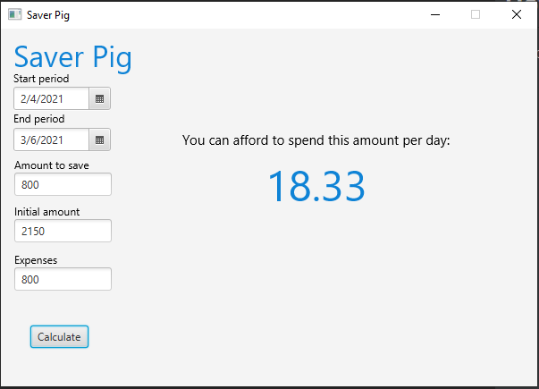

# Saver Pig
The tool helping me to save money.
## How to use
1. Select start date and date of the period.
2. Select the willing amount to save after the period.
3. Select the initial amount (for example your salary).
4. Select your expenses.
5. You will see the amount you can afford to spend daily to get your savings at the end of the period.
## Screen
